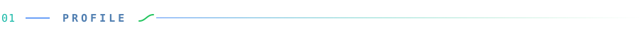
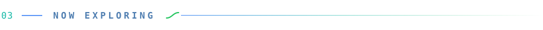

  

 

I'm a software engineer who has been building and shipping production systems since 2022 — today on a multilingual B2B international-trade platform where reliability, real-time data and clean delivery matter every day.

I hold an **MSc in Data Science**, with a thesis on **recommender systems**, and I'm deliberately moving toward **AI and machine-learning engineering**: not only how models are trained and evaluated, but how intelligent capabilities are designed into real software and carried into production.

<code>PRODUCTION-FIRST</code>&nbsp;&nbsp;·&nbsp;&nbsp;<code>DATA-DRIVEN BY DEFAULT</code>&nbsp;&nbsp;·&nbsp;&nbsp;<code>CURIOUS ABOUT HOW INTELLIGENT SYSTEMS ARE BUILT</code>

 

**In production** &nbsp;·&nbsp; A multilingual B2B trade platform with AI-assisted form filling and real-time auction and tender data, a business-automation system for inventory, production analytics and orders, and a data-aggregation MVP over web-scraped datasets — delivered through Docker-based CI/CD and multi-environment deployments.

**In AI & ML** &nbsp;·&nbsp; Recommender-systems research, the focus of my MSc thesis, including a controlled knowledge-graph ablation study of graph-based models. Alongside it, a multi-agent study assistant built on Google ADK and MCP, and end-to-end regression, classification and clustering experiments. You'll find these in the pinned repositories below.

 

- **Knowledge-aware recommender systems** — carrying my thesis work forward: when graph structure genuinely improves recommendations, and when it doesn't.
- **LLM agents and tool use** — multi-agent orchestration, MCP and human-in-the-loop safeguards.
- **From notebook to product** — bringing ML into the kind of production software I already build.

 

  
  
  
  

Questions or ideas? <a href="https://github.com/Hossein-Haghshenas/Hossein-Haghshenas/issues">Open a thread</a>.

